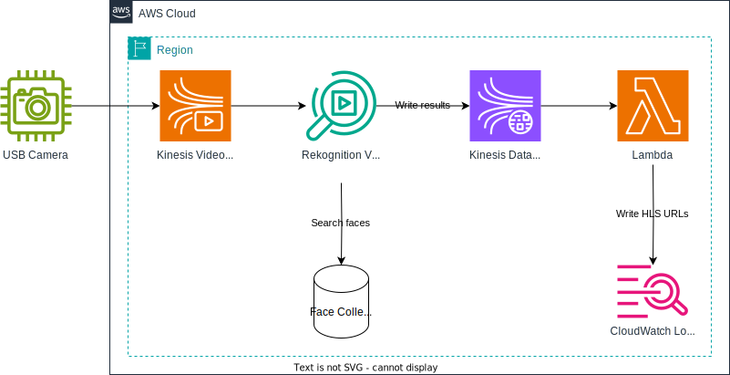
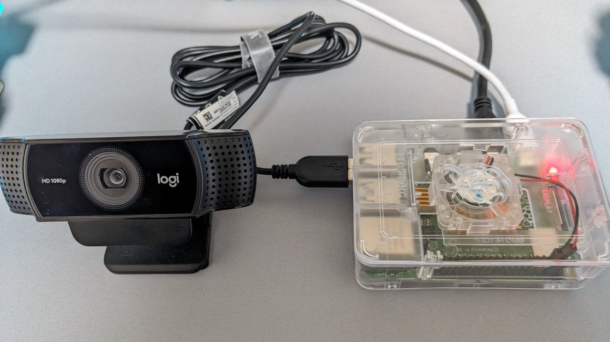
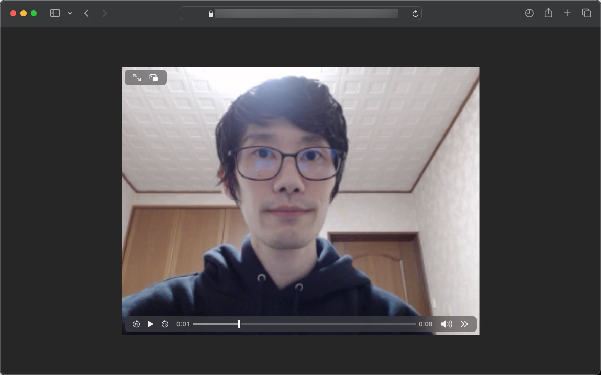

## Introduction

In this guide, we will implement a **face detection system** using a USB camera connected to a Raspberry Pi. The project leverages [Amazon Kinesis Video Streams](https://docs.aws.amazon.com/kinesisvideostreams/latest/dg/what-is-kinesis-video.html) and [Amazon Rekognition Video](https://docs.aws.amazon.com/rekognition/latest/dg/video.html) for processing and detecting faces in real-time.



## Prerequisites

### Hardware Requirements

- Raspberry Pi 4B with 4GB RAM
    - Running Ubuntu 23.10 (installed via [Raspberry Pi Imager](https://www.raspberrypi.com/software/))
- USB Camera

### Software Requirements

- GStreamer: Used to process and stream video.
    - Amazon Kinesis Video Streams CPP Producer, GStreamer Plugin, and JNI: Install from [AWS GitHub Repository](https://github.com/awslabs/amazon-kinesis-video-streams-producer-sdk-cpp/).
- AWS SAM CLI: Install from [official documentation](https://docs.aws.amazon.com/serverless-application-model/latest/developerguide/install-sam-cli.html).
- Python 3.11

## Setting Up the Project

### AWS SAM Template

Refer to [template.yaml](template.yaml).

### Python Script

Refer to [src/app.py](src/app.py).

The Rekognition Video stream processor streams detected face data to the Kinesis Data Stream, which is encoded as a **Base64 string** (line 18). For detailed information about the data structure, refer to the [official documentation](https://docs.aws.amazon.com/rekognition/latest/dg/streaming-video-kinesis-output.html).

The Lambda function generates an **HLS URL** using the [`KinesisVideoArchivedMedia#get_hls_streaming_session_url`](https://boto3.amazonaws.com/v1/documentation/api/latest/reference/services/kinesis-video-archived-media/client/get_hls_streaming_session_url.html) API (line 54-66).

### Build and Deploy

Build and deploy the project using the following commands:

```shell
sam build
sam deploy
```

### Indexing Faces

To detect faces using the USB camera, index faces into an Amazon Rekognition face collection. The [Index Faces API](https://docs.aws.amazon.com/rekognition/latest/APIReference/API_IndexFaces.html) is used for this purpose.

#### Command for Indexing Faces

Before running the following command, replace the placeholders `<YOUR_BUCKET>`, `<YOUR_OBJECT>`, and `<PERSON_ID>` with the actual values relevant to your use case.

```shell
aws rekognition index-faces \
  --image '{"S3Object": {"Bucket": "<YOUR_BUCKET>", "Name": "<YOUR_OBJECT>"}}' \
  --collection-id FaceCollection \
  --external-image-id <PERSON_ID>
```

#### Important Notes

**Amazon Rekognition does not store actual images** in the face collection. Instead, it extracts and saves facial features as metadata. This ensures that only essential facial feature data is stored securely.

For more details, refer to the [AWS documentation on indexing faces](https://docs.aws.amazon.com/rekognition/latest/dg/add-faces-to-collection-procedure.html).

> For each face detected, Amazon Rekognition extracts facial features and stores the feature information in a database.
> In addition, the command stores metadata for each face that's detected in the specified face collection.
> Amazon Rekognition doesn't store the actual image bytes.

### Setting Up the Video Producer

This guide uses a Raspberry Pi 4B with 4GB RAM running Ubuntu 23.10 as the video producer. A USB camera is connected to the Raspberry Pi to stream video to Amazon Kinesis Video Streams.



#### Building the AWS GStreamer Plugin

AWS provides an [Amazon Kinesis Video Streams CPP Producer, GStreamer Plugin and JNI](https://github.com/awslabs/amazon-kinesis-video-streams-producer-sdk-cpp/). This SDK facilitates video streaming from the Raspberry Pi to Kinesis Video Streams.

> [!WARNING]
> While AWS offers [Docker images](https://docs.aws.amazon.com/kinesisvideostreams/latest/dg/examples-gstreamer-plugin.html#examples-gstreamer-plugin-docker) for the GStreamer plugin, these images may not work on Raspberry Pi due to architecture limitations.

Follow the steps in the [Amazon Kinesis Video Streams CPP Producer, GStreamer Plugin and JNI](https://github.com/awslabs/amazon-kinesis-video-streams-producer-sdk-cpp/) to build the plugin on your Raspberry Pi.

### Building the GStreamer Plugin

To enable video streaming from your Raspberry Pi to Amazon Kinesis Video Streams, build the GStreamer plugin provided by AWS. Follow the steps below to complete the build process.

#### Build Steps

Run the following commands. Depending on your system's specifications, the build may take 20 minutes or more.

```shell
sudo apt update
sudo apt upgrade
sudo apt install \
  make \
  cmake \
  build-essential \
  m4 \
  autoconf \
  default-jdk
sudo apt install \
  libssl-dev \
  libcurl4-openssl-dev \
  liblog4cplus-dev \
  libgstreamer1.0-dev \
  libgstreamer-plugins-base1.0-dev \
  gstreamer1.0-plugins-base-apps \
  gstreamer1.0-plugins-bad \
  gstreamer1.0-plugins-good \
  gstreamer1.0-plugins-ugly \
  gstreamer1.0-tools

git clone https://github.com/awslabs/amazon-kinesis-video-streams-producer-sdk-cpp.git
mkdir -p amazon-kinesis-video-streams-producer-sdk-cpp/build
cd amazon-kinesis-video-streams-producer-sdk-cpp/build

sudo cmake .. -DBUILD_GSTREAMER_PLUGIN=ON -DBUILD_JNI=TRUE
sudo make
```

#### Verify the Build

Once the build completes, verify the result with the following commands:

```shell
cd ~/amazon-kinesis-video-streams-producer-sdk-cpp
export GST_PLUGIN_PATH=`pwd`/build
export LD_LIBRARY_PATH=`pwd`/open-source/local/lib
gst-inspect-1.0 kvssink
```

The output should display details similar to this:

```text
Factory Details:
  Rank                     primary + 10 (266)
  Long-name                KVS Sink
  Klass                    Sink/Video/Network
  Description              GStreamer AWS KVS plugin
  Author                   AWS KVS <kinesis-video-support@amazon.com>
...
```

#### Persistent Environment Variables

To avoid resetting environment variables every time, add the following exports to your `~/.profile`:

```shell
echo "" >> ~/.profile
echo "# GStreamer" >> ~/.profile
echo "export GST_PLUGIN_PATH=$GST_PLUGIN_PATH" >> ~/.profile
echo "export LD_LIBRARY_PATH=$LD_LIBRARY_PATH" >> ~/.profile
```

### Running GStreamer

After building the plugin, connect your USB camera to the Raspberry Pi and run the following command to stream video data to Amazon Kinesis Video Streams.

> [!WARNING]
> Enhancing video quality (e.g., increasing resolution or frame rate) may result in higher AWS costs.

```shell
gst-launch-1.0 -v v4l2src device=/dev/video0 \
  ! videoconvert \
  ! video/x-raw,format=I420,width=320,height=240,framerate=5/1 \
  ! x264enc bframes=0 key-int-max=45 bitrate=500 tune=zerolatency \
  ! video/x-h264,stream-format=avc,alignment=au \
  ! kvssink stream-name=<KINESIS_VIDEO_STREAM_NAME> storage-size=128 access-key="<YOUR_ACCESS_KEY>" secret-key="<YOUR_SECRET_KEY>" aws-region="<YOUR_AWS_REGION>"
```

#### Verifying Video Stream

You can verify the live stream by navigating to the Kinesis Video Streams management console. The video should display in real-time.


## Testing

### Starting the Rekognition Video Stream Processor

Start the [Rekognition Video stream processor](https://docs.aws.amazon.com/rekognition/latest/APIReference/API_StartStreamProcessor.html). This service subscribes to the Kinesis Video Stream, detects faces using the face collection, and streams the results to the Kinesis Data Stream.

Run the following command to start the stream processor:

```shell
aws rekognition start-stream-processor --name face-detector-rekognition-stream-processor
```

Verify the status of the stream processor to ensure it is running:

```shell
aws rekognition describe-stream-processor --name face-detector-rekognition-stream-processor | grep "Status"
```

The expected output should show `"Status": "RUNNING"`.

### Capturing Faces

Once the USB camera captures video, the following process is initiated:

1. Video Data Streaming: The video data is streamed to the Kinesis Video Stream.
2. Face Detection: The Rekognition Video stream processor analyzes the video stream and detects faces based on the face collection.
3. Result Streaming: Detected face data is streamed to the Kinesis Data Stream.
4. HLS URL Generation: A Lambda function generates an HLS URL for playback.

To check the results, view the Lambda function logs with the following command:

```shell
sam logs -n Function --stack-name face-detector-using-kinesis-video-streams --tail
```

### Sample Log Data

The log records include detailed information about the stream processor events, such as the following example:

```python
{
    "InputInformation": {
        "KinesisVideo": {
            "StreamArn": "arn:aws:kinesisvideo:<AWS_REGION>:<AWS_ACCOUNT_ID>:stream/face-detector-kinesis-video-stream/xxxxxxxxxxxxx",
            "FragmentNumber": "91343852333181501717324262640137742175000164731",
            "ServerTimestamp": 1702208586.022,
            "ProducerTimestamp": 1702208585.699,
            "FrameOffsetInSeconds": 0.0,
        }
    },
    "StreamProcessorInformation": {"Status": "RUNNING"},
    "FaceSearchResponse": [
        {
            "DetectedFace": {
                "BoundingBox": {
                    "Height": 0.4744676,
                    "Width": 0.29107505,
                    "Left": 0.33036956,
                    "Top": 0.19599175,
                },
                "Confidence": 99.99677,
                "Landmarks": [
                    {"X": 0.41322955, "Y": 0.33761832, "Type": "eyeLeft"},
                    {"X": 0.54405355, "Y": 0.34024307, "Type": "eyeRight"},
                    {"X": 0.424819, "Y": 0.5417343, "Type": "mouthLeft"},
                    {"X": 0.5342691, "Y": 0.54362005, "Type": "mouthRight"},
                    {"X": 0.48934412, "Y": 0.43806323, "Type": "nose"},
                ],
                "Pose": {"Pitch": 5.547308, "Roll": 0.85795176, "Yaw": 4.76913},
                "Quality": {"Brightness": 57.938313, "Sharpness": 46.0298},
            },
            "MatchedFaces": [
                {
                    "Similarity": 99.986176,
                    "Face": {
                        "BoundingBox": {
                            "Height": 0.417963,
                            "Width": 0.406223,
                            "Left": 0.28826,
                            "Top": 0.242463,
                        },
                        "FaceId": "xxxxxxxx-xxxx-xxxx-xxxx-xxxxxxxxxxxx",
                        "Confidence": 99.996605,
                        "ImageId": "xxxxxxxx-xxxx-xxxx-xxxx-xxxxxxxxxxxx",
                        "ExternalImageId": "iwasa",
                    },
                }
            ],
        }
    ],
}
```

### HLS URL for Video Playback

The logs also include the generated HLS URL for on-demand video playback, such as:

```text
https://x-xxxxxxxx.kinesisvideo.<AWS_REGION>.amazonaws.com/hls/v1/getHLSMasterPlaylist.m3u8?SessionToken=xxxxxxxxxx
```

#### Playing the Video

Open the HLS URL using a supported browser like Safari or Edge.

**Chrome does not natively support HLS playback**. You can use a third-party extension, such as [Native HLS Playback](https://chromewebstore.google.com/detail/emnphkkblegpebimobpbekeedfgemhof).



## Cleaning Up

To avoid incurring unnecessary costs, ensure you clean up all the AWS resources provisioned during this guide. Follow these steps:

### 1. Stop the Rekognition Video Stream Processor

Use the following command to stop the Rekognition Video stream processor:

```shell
aws rekognition stop-stream-processor --name face-detector-rekognition-stream-processor
```

### 2. Delete the SAM Stack
Run the command below to delete all resources provisioned by the AWS Serverless Application Model (SAM):

```shell
sam delete
```

These commands will remove all associated resources, including the Kinesis Video Stream, Kinesis Data Stream, Lambda function, and the Rekognition Video stream processor.

## Conclusion

This guide walked you through setting up a real-time face detection system using a Raspberry Pi, USB camera, Amazon Kinesis Video Streams, and Amazon Rekognition Video.

By integrating these technologies, you can process and analyze video streams efficiently, leveraging the power of AWS services to handle scalability and performance demands.
